# autoware-mih-dbw-interface



This repository provides code that allows Autoware to work with vehicles compliant with the MIH DBW (Drive-By-Wire) API and the underlying [MIH Open EV Platform](https://developer.mih-ev.org/) software stack for software defined vehicles.

## Background

The [MIH](https://www.mih-ev.org/) DBW API was designed by the MIH Autonomy working group in association with the [Autoware Foundation](https://www.autoware.org/), and provides command interfaces to interact with the vehicle's acceleration, deceleration, brake and steering, and report interfaces to provide feedback for the common platform states. 

By publishing and/or subscribing to the appropriate topics for these interfaces, developers will be able to create mission critical software that can control the acceleration, deceleration and turning angle of vehicles for AD or ADAS systems.

To ensure compatibility with MIH's Open EV Platform, the Autoware Foundation has implemented the specification set out in the MIH DBW API and will ensure that it remains compliant with the specification as and when it is updated. 

Further information about MIH's working groups can be found at the [MIH homepage](https://www.mih-ev.org/en/groups/?page_name=WorkingGroups).


## How to use

WIP

## Interfaces

### Command Interfaces

The command interfaces provide programmable interfaces to interact with the vehicle's acceleration, deceleration, brake, and steering. The interface is based on Autoware.Auto implementation for easy adaption. Developers should send control commands to one of the following DDS topics:
- VehicleControlCommand
- HighLevelControlCommand

#### VehicleControlCommand
- The VehicleControlCommand interface provides access to full range control of steering/acceleration/deceleration/brake and is limited only by the hardware. This is intended for applications such as Autonomous Driving and Autonomous Valet Parking.
- The VehicleControlCommand interface should publish at a rate of 40Hz minimum.
- The VehicleControlCommand interface consists of the following data fields:

```
- stamp
  - Timestamp value in nanoseconds or the unit defined by the system.
- velocity (float32)
  - Desired vehicle speed in m/s
- acceleration (float32)
  - Desired acceleration / deceleration rate in m/s2
- front_wheel_angle (float32)
  - Desired front wheel turning radius
- rear_wheel_angle (float32)
  - Desired rear wheel turning radius
- front_wheel_angle_rotation_rate (float32)
  - Desired front wheel rotation rate
- rear_wheel_angle_rotation_rate (float32)
  - Desired front wheel rotation rate 
- front_wheel_steering_torque (float32)
  - Desired front wheel torque
- rear_wheel_steering_torque (float32)
  - Desired rear wheel torque
```

#### HighLevelControlCommand
- The HighLevelControlCommand interface provides a limited range of steering/acceleration/deceleration/brake controls, this is mainly for applications such as Lane Keeping Assist, Lane Departure Assist, Traffic Jam Assist, Autonomous Emergency Braking etc.
- It is recommended to follow ISO15622:2018 as a guideline for the accessible control range.
- The HighLevelControlCommand interface should send at a rate of 40Hz minimum.
- The HighLevelControlCommand interface consists of the following data fields:

```
- stamp
  - Timestamp value in nanoseconds or the unit defined by the system
- velocity (float32)
  - Desired vehicle speed in m/s
- curvature (float32)
  - Desired vehicle curvature (1/radius in m)
- torque (float32)
  - Desired steering torque
```

### Vehicle Interface

Vehicle Interface provides an abstraction layer to the vehicle / skateboard, its purpose is to translate DDS messages into platform specific messages such as CAN, CAN-FD, Adaptive AUTOSAR, FlexRay. DDS is the communication middleware used in MIH Open EV Platform, it is widely adapted in many industries and applications such as Robotics, IoT, Automotive. See https://www.omg.org/omg-dds-portal/ for more information.

The diagram below explains how the Vehicle Interface works in between DDS and CAN:



#### Vehicle Database
- The vehicle database provides general information of the vehicle / skateboard such as steering ratio, weight, wheelbase, and tuning parameters. It also provides look up tables to translate CAN / CAN-FD / AUTOSAR / FlexRay messages to common state definition as well as the control messages of steering, acceleration, deceleration, and brake.
- The vehicle database will be provided by OEMs.


### Report Interfaces

The report interfaces provide feedback for the common platform states. The interface is based on the Autoware.Auto implementation for easy adaption. Developers will be able to subscribe the following topics from DDS middleware:
- VehicleOdometry

#### VehicleOdometry
- The VehicleOdometry interface reports steering / speed status of a vehicle/skateboard.
- The VehicleOdometry interface should send at a rate of 40Hz minimum.
- The VehicleOdometry interface consists of the following data types:

```
  - stamp
    - Timestamp value in nanoseconds or the unit defined by the system
  - velocity (float32)
    - Actual vehicle speed in m/s
  - front_wheel_angle (float32)
    - Actual front wheel turning radius
  - rear_wheel_angle (float32)
    - Actual rear wheel turning radius
  - wheel_speeds[] (Optional) (float32[])
    - The rotation speed of each tire
  - yaw_rate (Optional) (float32)
    - calculated by wheel speed difference or vehicle model
```